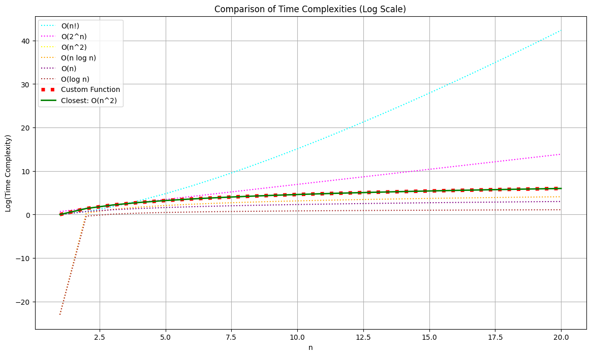
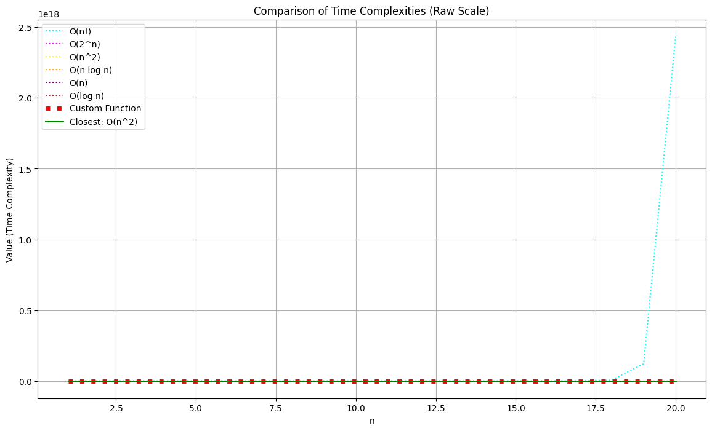
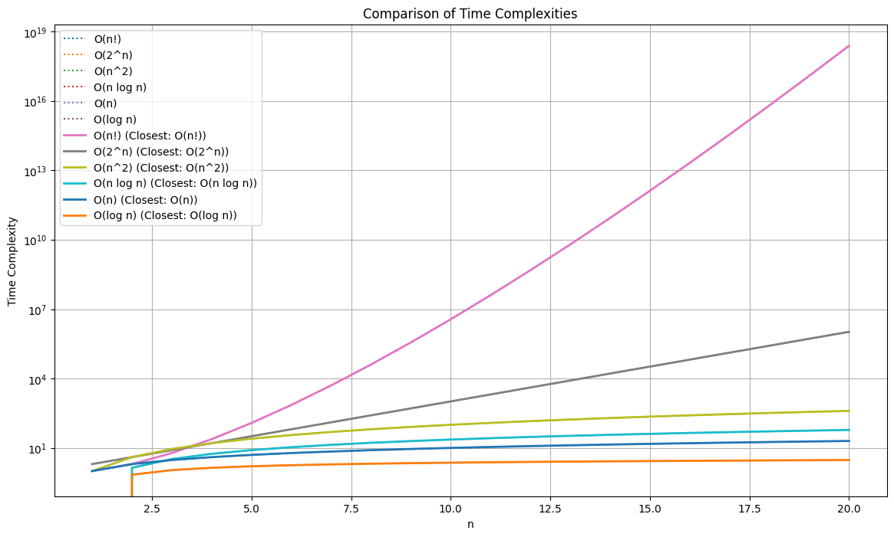
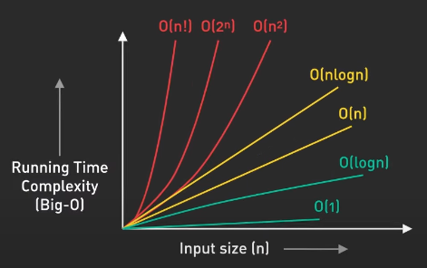

# Time Complexity Visualization

This project visualizes the time complexities of various functions and compares them to standard complexity classes. It allows you to define custom functions and see how their growth rates compare to known complexities like O(n^2), O(2^n), O(n!), etc.

## Features

- Compare custom functions against standard complexity classes.
- Visualize the growth rates using matplotlib.
- Automatically identify and highlight the closest matching complexity class.
- Randomly select and visualize different custom functions.

## Usage

1. Define your custom functions with different complexities. Example functions with O(n^2), O(2^n), and O(n!) complexities are provided.

2. The main script randomly selects one of the custom functions and compares its time complexity to standard classes.

3. The script will print the name of the chosen function and display a plot comparing its growth rate to the standard complexity classes. The custom function's growth is shown in red, the closest matching complexity class in green, and the rest in different dotted colors.

## Files

### [time_complexity_visualization_log_scaled_comparison.py](time_complexity_visualization_log_scaled_comparison.py)
This script compares the time complexities of a custom function to standard complexity classes and visualizes the results on a logarithmic scale.

### [time_complexity_visualization_raw_scaled_comparison.py](time_complexity_visualization_raw_scaled_comparison.py)
This script compares the time complexities of a custom function to standard complexity classes and visualizes the results on a raw scale (linear).

### [time_complexity_visualization_modelling.py](time_complexity_visualization_modelling.py)
This script contains the definition of the custom functions used for comparison, including examples with O(n^2), O(2^n), and O(n!) complexities.

### [time_complexity_visualization_log_scaled_comparison.png](time_complexity_visualization_log_scaled_comparison.png)

A sample output image showing the comparison of time complexities on a logarithmic scale.

### [time_complexity_visualization_raw_scaled_comparison.png](time_complexity_visualization_raw_scaled_comparison.png)

A sample output image showing the comparison of time complexities on a raw (linear) scale.

### [time_complexity_visualization_modelling.png](time_complexity_visualization_modelling.png)

A sample output image showing the modelling of different custom functions with their corresponding time complexities.

This should look similar to

